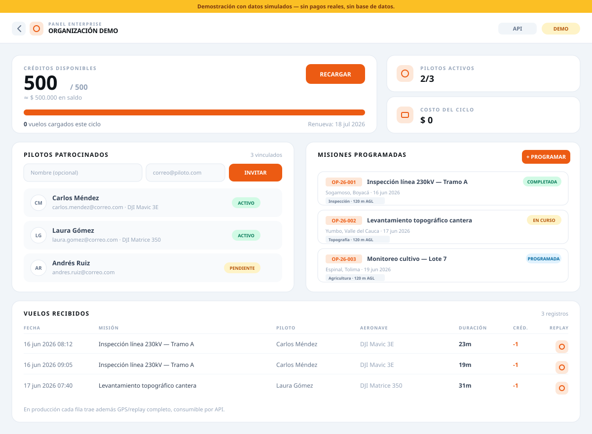
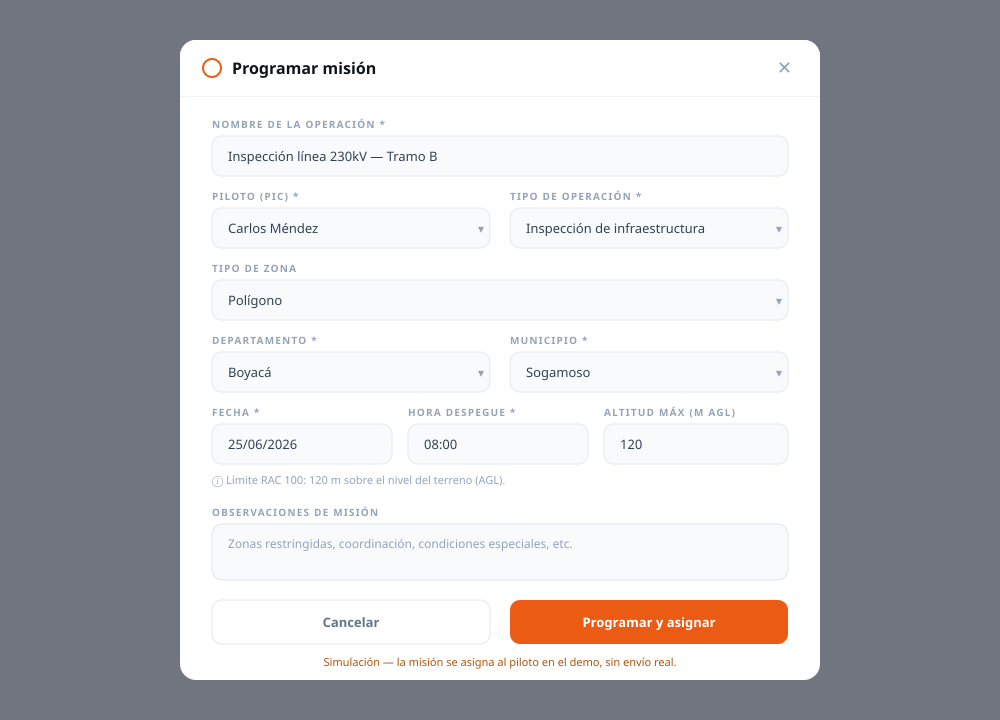
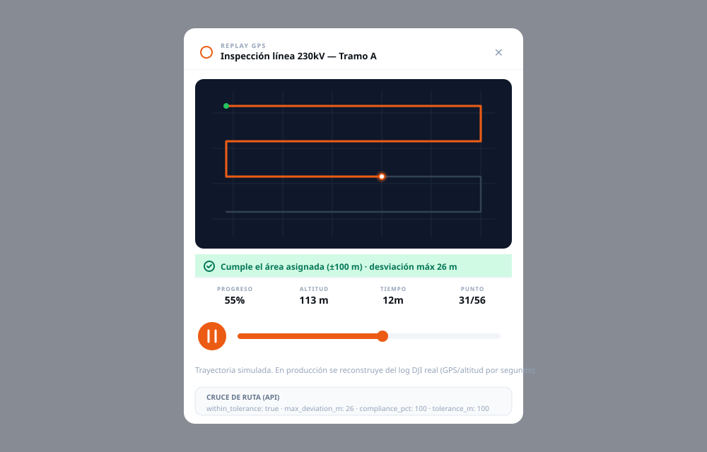
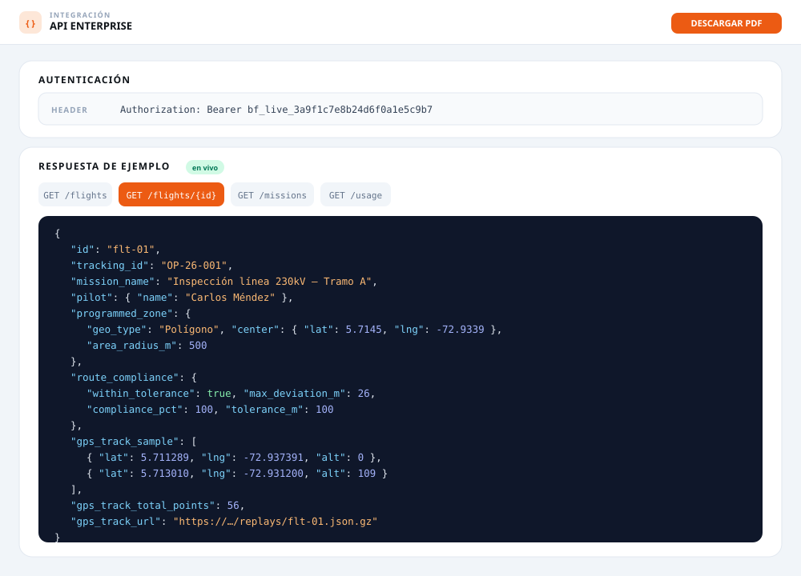

# Anexos — Demo Enterprise (perfil de la organización en funcionamiento)

> Mockups fieles al demo en vivo: **https://demo-bitafly-enterprise.vercel.app** (contraseña `12345678`).
> Representan cómo se ve el **perfil de la organización** operando el plan pago-por-vuelo.
> Datos de ejemplo (simulación) — no son cobros ni vuelos reales.

---

## Anexo 1 — Dashboard de la organización

Vista principal del perfil de la organización: medidor de créditos prepago, indicadores
(pilotos activos, costo del ciclo), pilotos patrocinados vinculados, misiones programadas
con su ID de seguimiento, y los vuelos recibidos de los pilotos.

---

## Anexo 2 — Programar misión (RAC 100)

Formulario con el que la organización programa un vuelo y lo asigna a un piloto patrocinado:
nombre de la operación, PIC, tipo de operación, zona, departamento/municipio, fecha/hora,
altitud máxima (límite 120 m AGL) y observaciones de misión.

---

## Anexo 3 — Replay GPS + cumplimiento de ruta

Reproducción de la trayectoria volada con verificación automática contra el área programada:
si el vuelo se mantuvo dentro del área asignada con tolerancia de **100 m**, se marca como
cumplido (con la desviación máxima detectada).

---

## Anexo 4 — API de integración

Respuesta de la API que la organización consume para integrar la información a sus sistemas:
incluye el **ID de seguimiento**, la **zona programada**, las **coordenadas GPS** por donde
voló la aeronave y el resultado del **cruce de cumplimiento de ruta** (tolerancia 100 m).

---

### Nota
Los anexos están en formato SVG (vectorial) en `docs/anexos/`. Se visualizan directamente
en GitHub y en cualquier visor/markdown. Para incluirlos en una propuesta en PDF/Word, pueden
exportarse a PNG desde el navegador o cualquier editor.
